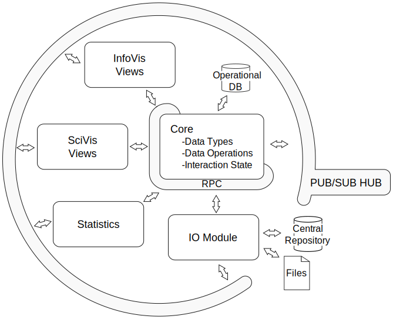

.. _introduction:

Introduction
============

Indyva (Interactive Dynamics for Visual Analytics) is a framework that
makes easy the creation of Visual Analytics prototypes.

* Indyva provides a model for common dataset types as well as a model
  for interaction states, so you can design totally decoupled
  components that will integrate and interact without hassle. 
* Indyva is a solid base for polyglot programming so you can use your
  preferred programming language.
* Indyva is not opinionated about interactive or rendering
  technologies so you can choose the best technology for each
  interface.
* Indyva is base on services so you can scale each part as you need
  easier.

The goal
--------

Indyva is designed with a particular scenario in mind. The main goal
is to reduce the developing time of interactive visual analytics
prototypes in research domains. In places like university labs is very
common that these prototypes are implemented by one person or by very
small groups of people. Usually in these situations the focus is not
on creating high quality software but having something done quickly so
the researchers can test new ideas with final users.

The election of the technology (programming language, and libraries)
can be guided by personal preferences of the developer, by the 'not
reinventing the wheel' principle, or by an integrative effort of tools
inside a group legacy. None of these alternatives is the silver bullet
for productivity. Sometimes the developer is very productive with some
technology and is the way to go, but sometimes the most powerful
libraries for a problem are written in other programming languages so
is better to change the stack. The third strategy enhance productivity
by reusing in-house developments. 

Indyva is a framework that let the developer to take advantage of the
best of these three strategies:

* Be productive by writing in your preferred language.
* Be productive by using the most appropriate library for each
  particular component of your system, coordinating every piece no
  mater the language they are written in.
* Be productive by reusing and integrating components from different
  prototypes of your lab. Indiva makes easier to communicate
  developments even when they where not designed to be working together.

The problem
-----------

So why laying so much emphasis on productivity ?

During my Phd studies I developed several interactive tools for
image analysis and data extraction of neuronal features and for the
exploratory analysis of the available data.  

Although after their evaluations the interactive exploratory analysis
tools have received rave reviews, users have not given a prolonged use
in time, or at least, it can be considered quite limited compared to
time working with the data extraction tools. This is because the
exploratory analysis tools are specifically designed to solve a
particular task on particular data. 

Usually, this tuple (task, data) changes from experiment to
experiment. This should not be a serious problem from the user point
of view, but the development time and effort required by each
prototype is not negligible, as it can be imagined.  This fact implies
that although the new experiments would benefit of the guaranties
offered by the new interactive tools developed for the specific
problems, often, they are faced with generic statistical tools (e.g
Excel) considering the temporal requirements and available resources
of any research effort.

To tackle this problem, two ways can be taken. On one hand, implement
a very flexible tool that provides a range of visualization and data
processing operations more generic.  This approach loses the
advantages of working with an interface specifically designed for one
tuple, but gains in the number of experiments where this tool can be
applicable. On the other hand, considering the resources consumed
developing this type of tools, the overall productivity can be
increased if we could adapt a generic solution so the development is
restricted to just adjusting the tool interface to a particular tuple
(task, data).

On the market there are already generic tools, such as Spotfire,
Tableau, Gephi, etc.  Each focuses on a different data type, like
multivariate, networks, hierarchies, maps... , but none of them offers
the flexibility, for example, of combining symbolic representations
with tridimensional representations. Another drawback of the generic
tools is that they require some background on visualization techniques
to allow users to get working with the most suitable method and don't
grope in the dark for a long time, causing frustration and consequent
rejection of new attempts to use these tools.

Ad-hoc tools have the advantages that are potentially more intuitive
to use, can include any specific type of interaction developed for the
analysis task to perform and heterogeneous data can be analysed on a
single tool.

Considered the two alternatives, at the end of my thesis I decided
that I would implement a software system that facilitates the
implementation of interactive exploratory analysis tools, saving
development time.
  
Design Overview
---------------

**Multilingual api:**
    When creating new visualizations, rely on powerful graphics
    libraries is essential, but there is no common programming
    language for the proposed libraries so **I need to implement
    a solution that would be usable from many programming languages**.

    Another advantage of this approach is that opens the possibility
    to use statistics packages of the vast ``R`` 's library within
    the system. Furthermore, developers are more productive
    programming in a language that they master.  

**Over the net api:**
    One solution for supporting a variety of programming languages is
    developing the system in a low level language like ``C`` and
    create bindings for the required languages. The problem with this
    approach is the complexity introduced with the creation and
    maintenance of these bindings. Instead of this approach, **a
    network api is preferred**. It could be less efficient in
    computational resources, but definitely easier to create and
    maintain. 

**Unique state placed into the backend:**
    The synchronization among views, data transformation libraries and
    interactive widgets is the main advantage for using the
    system. Obviously, dataset modifications, for example as a result
    of a filtering operation, have to be propagated to the views, but
    also interaction state like selections, annotations or
    highlights. **The proposed solution is to represent all the
    information needed for the synchronization inside the model and be
    managed as a first-citizen item like the dataset**.  

**Decoupled Components:**
    The intercommunication between components marks the flexibility of
    the system. The core has to provide a wide api that will be
    called by peripheries through a known rpc
    interface. However, other optional components should not use this
    mechanism. In order to gain flexibility and create components that
    can be used as independent as possible they do not have to know
    each others directly. By implementing the ``PUB/SUB``
    pattern the different components can interact only knowing a
    predefined protocol.  

    Also, each component of the system has to be
    synchronized with the model. The ``PUB/SUB`` pattern
    provides a good solution because in big systems highly
    interconnected it reduces the complexity and improves the
    scalability in comparison with the observer pattern. This design
    decision is very important because the asynchronous nature of the
    system. In other words, **every component will be reacting
    to the events fired by the user, so the event messaging system is
    a key component in this kind of development.**  

**Declarative Data Transformations:**
    In one hand, imperative programming is well known and the majority
    of the programming languages are oriented this way. But in the
    other hand, declarative programing is widely use in data
    manipulation (``SLQ``, ``LINQ``, etc.)  because it
    completely hides implementation decisions, allows further
    optimizations, and behaves well with asynchronous programming by a
    better control of side effects.  **Therefore, the data
    transformation api should be declarative instead of
    imperative**.

Architecture
^^^^^^^^^^^^

   The design of the system's architecture.

**Core:**
   The central module of the framework provides a set of
   implementations of data types and their common analytical
   actions. Furthermore, the Core acts not only as a model of the
   dataset but also as a model of the state of the interaction
   (e.g. selections, filters or highlights). Also, it offers a set of
   widgets so users can perform these common analytical actions
   interacting with a gui. Besides, this module has an
   imperative api for all kind of functions except the
   above-mentioned analytical actions. For these common tasks a
   declarative api is more suitable as previously
   indicated. Moreover, the complete api is accessible by
   different languages through the rpc mechanism. Apart from
   this, in order to maintain the synchronization, every change in the
   model is propagated by the PUB/SUB system so every view
   can be updated in consequence. Finally, the module relies on an
   database for the management of big datasets, bigger than the
   machine's ram, and depending its efficiency, it could be use
   for little datasets too.

**PUB/SUB Hub:** 
   As previously mentioned, the PUB/SUB pattern is a
   flexible solution for decoupling the different components of the
   system. The events are sent from a publisher through a particular
   channel and, as a result, subscribers of this channel are
   notified. Publishers do not know subscribers and vice versa, and
   because this system aims to be very extensible, the hub needs to
   provide some kind of Service Discovery Protocol so new modules can
   offer new resources.

**IO Module:**
   This module is responsible for the acquisition of data, the
   persistence of the state of the analysis between sessions and the
   exportation of data in a variety of formats. The data acquisition
   could be performed from isolated files or from a central
   repository. The module must support not only common formats in
   which users usually have data but also extension points for other
   file formats. In the same way, intercommunication with databases
   should be facilitated. Analysis may be saved and loaded between
   sessions to/from a file or to/from a database. Finally, this module
   should facilitate data export to third party data formats.

**InfoVis Views:**
   This module provides the necessary mechanisms for communicating the
   views developed by third parties with the rest of the system. In
   order to facilitate the implementation of new views, this module
   provides the base class of an infovis view and the
   implementation of the protocol's api over the
   PUB/SUB system. Moreover, it offers a catalog of
   reusable components useful in this kind of representations, both
   graphic and interaction components. As mentioned above, for the
   infovis views the chosen library is D3.js so this
   module will be implemented in JavaScript.

**SciVis Views:** 
   This module is the equivalent to the infovis Views module but
   focused on the scivis field. It provides the same services
   but implemented in C++ since these views are based on
   vtk.

**Statistics Module:**
   Despite the most common data operations are implemented in the Core
   module, users usually need to perform more complex tasks like
   regression, dimensionality reduction, classification or comparison
   of distributions. The development of these kind of algorithms is
   not trivial so using a comprehensive library, like the one provided
   with R, is essential for achieving short developing
   times. This module helps with the intercommunication between
   statistical algorithms and the system.
   

